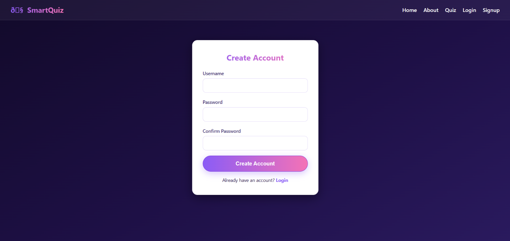
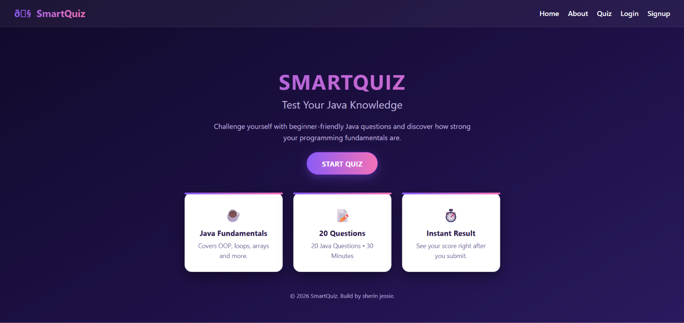

<div align="center">

# 🎯 SmartQuiz – Online Exam & Quiz System

**A web-based platform to create, attempt, and evaluate quizzes and online exams.**


</div>

---

## 📖 About the Project

**SmartQuiz** is an online examination and quiz system built with **Java (JSP)** on the backend and **HTML, CSS, and JavaScript** on the frontend. It uses **JDBC** to connect to a **MySQL** database and runs on the **Apache Tomcat** server.

Users can sign up, log in, attempt quizzes within a time limit, and view their results instantly — making exams faster, paperless, and easier to manage.

---

## ✨ Features

- 🔐 **User Authentication** – Secure sign up and login
- 📝 **Online Quizzes / Exams** – Multiple-choice questions loaded from the database
- ⏱️ **Timer** – Quiz auto-submits when time runs out
- ✅ **Instant Evaluation** – Score calculated automatically on submission
- 📊 **Result Page** – Shows score and performance after each attempt
- 🗄️ **Database Storage** – Users, questions, and results stored in MySQL
- 🎨 **Responsive UI** – Clean interface built with HTML, CSS, and JavaScript

---

## 🛠️ Tech Stack

| Layer       | Technology                  |
|-------------|-----------------------------|
| Frontend    | HTML, CSS, JavaScript       |
| Backend     | Java, JSP                   |
| Database    | MySQL                       |
| Connectivity| JDBC                        |
| Server      | Apache Tomcat               |
| IDE         | Eclipse (Dynamic Web Project) |

---

## 📂 Project Structure

```
SmartQuiz--Online-system/
├── .settings/            # Eclipse project settings
├── src/
│   └── main/
│       └── webapp/       # JSP pages, HTML, CSS, JS, and WEB-INF
├── .classpath            # Eclipse classpath configuration
├── .project              # Eclipse project file
└── README.md
```

---

## ⚙️ Prerequisites

Make sure you have the following installed:

- [Java JDK](https://www.oracle.com/java/technologies/downloads/) (8 or above)
- [Eclipse IDE for Enterprise Java and Web Developers](https://www.eclipse.org/downloads/)
- [Apache Tomcat](https://tomcat.apache.org/) (9 or above)
- [MySQL Server](https://dev.mysql.com/downloads/) and MySQL Workbench
- [MySQL Connector/J](https://dev.mysql.com/downloads/connector/j/) (JDBC driver `.jar`)

---

## 🚀 Getting Started

### 1️⃣ Clone the repository

```bash
git clone https://github.com/sherinjessie/SmartQuiz--Online-system.git
```

### 2️⃣ Import into Eclipse

1. Open Eclipse → **File → Import → Existing Projects into Workspace**
2. Select the cloned `SmartQuiz--Online-system` folder
3. Click **Finish**

### 3️⃣ Set up the database

1. Open MySQL and create the database:

   ```sql
   CREATE DATABASE smartquiz;
   ```

2. Create the required tables (users, questions, results) used by the project.
3. Update the database **URL, username, and password** in the project's JDBC connection code to match your MySQL setup:

   ```java
   String url  = "jdbc:mysql://localhost:3306/smartquiz";
   String user = "root";
   String pass = "your_password";
   ```

### 4️⃣ Add the MySQL JDBC driver

Copy the **MySQL Connector/J `.jar`** file into:

```
src/main/webapp/WEB-INF/lib/
```

### 5️⃣ Configure Tomcat & run

1. In Eclipse, open the **Servers** tab → add **Apache Tomcat**
2. Right-click the project → **Run As → Run on Server**
3. Open your browser and go to:

   ```
   http://localhost:8080/SmartQuiz--Online-system/
   ```

---

## 🔄 How It Works

```
Sign Up / Login  →  Choose Quiz  →  Answer Questions (Timer)  →  Submit  →  View Result
```

---

## 📸 Screenshots

> Add your screenshots here

| Sign Up | Quiz Page | Result |
|---------|-----------|--------|
|  |  |  |

---

## 🔮 Future Enhancements

- 👨‍🏫 Admin panel to add, edit, and delete questions
- 🏆 Leaderboard and score history
- 📚 Multiple subjects and difficulty levels
- 📧 Email verification and password reset
- 📱 Improved mobile responsiveness

---

## 👩‍💻 Author

**Sherin Jessie W.**
B.E. Computer Science Engineering (AI & ML)

[](https://github.com/sherinjessie)

---
